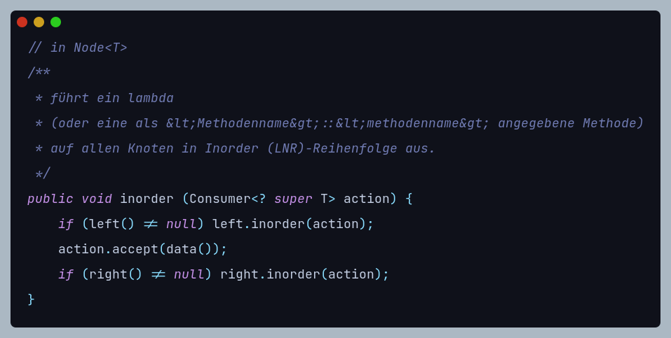

# Abitur Informatik 2016

## Abschnitt I:  4


### I: 4/a


> *Algorithmus*: Liste (vorher sortiert!) in hälfte teilen

- meier@gmy.de,
  - krause@wep.de,
    - fischer@wep.com,
    - leicht@gmy.com,
  - schulze@aoe.de und
    - meyer@gmy.de,
    - stark@gmy.de
  
Die Reihenfolge, in der sie eingeordnet werden könnten, um diesen Baum zu bekommen: 

1. meier@gmy.de
2. krause@wep.de
3. fischer@wep.de
4. leicht@gmy.com
5. schulze@aoe.de
6. meyer@gmy.de
7. stark@gmy.de

### I: 4/b


→ für 10,000 Kunden braucht man mindestens 14 Ebenen und damit **maximal 14 vergleiche**.

### I: 4/c

> Compatibility: JDK-8 or higher (JDK-17 for best results → records)


> Abgesehen von Bezeichnern müssten sich (teilw.) Methodnsiganturen ändern




## Abschnitt II: 3


### II: 3/a


````roomsql
SELECT kundennummer FROM kunden WHERE nachname="huber" AND vorname="herbert";
````

### II: 3/b


````yaml
Problem: Der Vor- und Nachname ist etwas, das einige freiwillig teilen
Lösungsvorschläge: 
  - Multi-Factor-Authentification (MFA): 
    Der Kunde muss beim Anmelden (oder Abfragen der Kundennummer) eine E-Mail,
    SMS, TAN, o.ä. bestätigen
  - Bessere Anmeldedaten: 
    Statt mit der Kundennummer kann der Kunde sich mit E-Mail und/oder Telefon-
    nummer anmelden (auch koppelbar mit → MFA)
  - OAuth: 
    OAuth ist ein Service, den bestimmte Firmen wie Microsoft, Twitter, GitHub,
    Google, Facebook und Apple anbieten, bei dem sich der Kunde auf der 
    jeweiligen Platform anmeldet, um die eigene Identität zu bestätigen.
   
    → diese schickt dann einen Token zurück, der zur weiteren Identifikation 
      genutzt werden kann.
````

### II: 3/c


> Reihenfolge: Prefix (NLR),
> per \t: 1 level

- Adenauer
  - Erhard
    - Brandt 
    - Kiesinger
      - Schmidt
        - Kohl
          - Merkel
        - Schröder 

### II: 3/d


```yaml
n: 2000000
min: ⌈log&#x2082; (n)⌉ = 21
    → mindestens (im best-case szenario) 21 Ebenen
max: n = 2000000
    → maximal (im worst-case szenario) 2 Millionen Ebenen (→ Liste)
```

> Wenn Bäume in einer nicht-optimalen Reihenfolge ([→ S. II: 3/c](#ii--3c)) eingefügt werden, 
> werden einige Vergleiche durchgeführt, die nicht durchgeführt werden müssten, wenn der Baum 
> in einer optimalen Reihenfolge eingepflegt wurde. 

<div style="display: flex; flex-direction: row">
  <div style="background-color: #021019; border-radius: 1em; padding-right: 15px">
  <ul>
     <li>Kiesinger</li>
     <ul>
       <li>Brandt</li><ul><li>Adenauer</li><li>Erhard</li></ul>
       <li>Merkel</li><ul><li>Kohl</li><li>Schmidt</li><ul><li>Schröder</li></ul></ul>
      </ul>
    </ul>
  </div>
  <div style="background-color: #021019; border-radius: 1em; padding-right: 15px">
    <ul>
      <li>Adenauer</li>
      <ul>
        <li>Brandt</li>
        <ul>
          <li>Erhard</li>
          <ul>
            <li>Kiesinger</li>
            <ul>
              <li>Kohl</li>
              <ul>
                <li>Merkel</li>
                <ul>
                  <li>Schmidt</li>
                  <ul>
                    <li>Schröder</li>
                  </ul>
                </ul>
              </ul>
            </ul>
          </ul>
        </ul>
      </ul>
    </ul>
  </div>
</div>

> Optimale Anordnung: Ø1-2 vgl, worst case: 3 vgl  
> Lineare  Anordnung: Ø4-5 vgl, worst case: 8 vgl